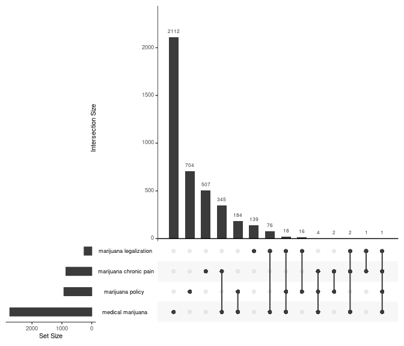

<!-- badges: start -->

[](https://app.travis-ci.com/github/jaytimm/pubmedr)
[](https://github.com/jaytimm/pubmedr/actions)
<!-- badges: end -->

*Updated: 2023-01-12*

# pubmedr

An R package for (1) querying the PubMed database & parsing retrieved
records; (2) extracting full text articles from the Open Access subset
of the PMC via ftp; (3) obtaining citation data from NIH’s Open Citation
Collection/[iCite](https://icite.od.nih.gov/); and (4) accessing
annotations of biomedical concepts from [PubTator
Central](https://www.ncbi.nlm.nih.gov/research/pubtator/).

-   [pubmedr](#pubmedr)
    -   [Installation](#installation)
    -   [PubMed search](#pubmed-search)
        -   [Basic search](#basic-search)
        -   [Multiple search terms](#multiple-search-terms)
    -   [Retrieve and parse abstract
        data](#retrieve-and-parse-abstract-data)
        -   [Record details](#record-details)
        -   [MeSH Annotations](#mesh-annotations)
        -   [Affiliations](#affiliations)
    -   [Citation data](#citation-data)
        -   [Summary data](#summary-data)
        -   [Network data](#network-data)
    -   [Biomedical concepts via the Pubtator Central
        API](#biomedical-concepts-via-the-pubtator-central-api)
    -   [Full text from Open Acess PMC](#full-text-from-open-acess-pmc)
        -   [Load list of Open Access PMC
            articles](#load-list-of-open-access-pmc-articles)
        -   [Extract full text articles](#extract-full-text-articles)
    -   [MeSH extensions](#mesh-extensions)
        -   [Thesauri](#thesauri)
        -   [Trees](#trees)
        -   [Pharmacological Actions](#pharmacological-actions)
        -   [Embeddings](#embeddings)

## Installation

You can download the development version from GitHub with:

``` r
devtools::install_github("jaytimm/pubmedr")
```

## PubMed search

### Basic search

The `pmed_search_pubmed()` function is meant for record-matching
searches typically performed using the [PubMed online
interface](https://pubmed.ncbi.nlm.nih.gov/). The `search_term`
parameter specifies the query term; the `fields` parameter can be used
to specify which fields to query.

``` r
med_cannabis <- pubmedr::pmed_search_pubmed(search_term = 'medical marijuana', 
                                            fields = c('TIAB','MH'))
```

    ## [1] "medical marijuana[TIAB] OR medical marijuana[MH]: 2742 records"

``` r
head(med_cannabis)
```

    ##          search_term     pmid
    ## 1: medical marijuana 36626471
    ## 2: medical marijuana 36623871
    ## 3: medical marijuana 36609049
    ## 4: medical marijuana 36607641
    ## 5: medical marijuana 36600251
    ## 6: medical marijuana 36576970

### Multiple search terms

``` r
cannabis_etc <- pubmedr::pmed_search_pubmed(
  search_term = c('marijuana chronic pain',
                  'marijuana legalization',
                  'marijuana policy',
                  'medical marijuana'),
  fields = c('TIAB','MH'))
```

    ## [1] "marijuana chronic pain[TIAB] OR marijuana chronic pain[MH]: 862 records"
    ## [1] "marijuana legalization[TIAB] OR marijuana legalization[MH]: 253 records"
    ## [1] "marijuana policy[TIAB] OR marijuana policy[MH]: 929 records"
    ## [1] "medical marijuana[TIAB] OR medical marijuana[MH]: 2742 records"

``` r
UpSetR::upset(UpSetR::fromList(split(cannabis_etc$pmid,
                                     cannabis_etc$search_term 
                                     )), 
              nsets = 4, order.by = "freq")
```



## Retrieve and parse abstract data

### Record details

For quicker abstract retrieval, be sure to get an [API
key](https://support.nlm.nih.gov/knowledgebase/article/KA-03521/en-us).

``` r
med_cannabis_df <- pubmedr::pmed_get_records2(pmids = unique(med_cannabis$pmid)[1:100], 
                                              with_annotations = T,
                                              # cores = 5, 
                                              ncbi_key = key) 
```

``` r
med_cannabis_df0 <- data.table::rbindlist(med_cannabis_df)

n <- 1
list(pmid = med_cannabis_df0$pmid[n],
     year = med_cannabis_df0$year[n],
     journal = med_cannabis_df0$journal[n],
     articletitle = strwrap(med_cannabis_df0$articletitle[n], width = 60),
     abstract = strwrap(med_cannabis_df0$abstract[n], width = 60)[1:10])
```

    ## $pmid
    ## [1] "36626471"
    ## 
    ## $year
    ## [1] "2022"
    ## 
    ## $journal
    ## [1] "Medicine"
    ## 
    ## $articletitle
    ## [1] "Review of systemic and syndromic complications of cannabis"
    ## [2] "use: A review."                                            
    ## 
    ## $abstract
    ##  [1] "Prescribed and non-prescribed cannabis use is common."      
    ##  [2] "Providers in specialties treating chronic pain - primary"   
    ##  [3] "care, pain management, and neurology-will be coming across" 
    ##  [4] "medical cannabis as a treatment for chronic pain,"          
    ##  [5] "regardless of whether they are prescribers. It is important"
    ##  [6] "to be aware of the systemic and syndromic complications of" 
    ##  [7] "acute and chronic cannabis use in the differential"         
    ##  [8] "diagnosis of cardiac, cardiovascular, cerebrovascular,"     
    ##  [9] "gastrointestinal, and psychiatric disorders. Medical"       
    ## [10] "cannabis is legal in 36 states. Studies have shown several"

### MeSH Annotations

> Annotations are included as a list-column, and can be easily
> extracted:

``` r
annotations <- data.table::rbindlist(med_cannabis_df0$annotations)
```

``` r
annotations |>
  filter(!is.na(FORM)) |>
  slice(1:10) |>
  knitr::kable()
```

| ID       | TYPE      | FORM                          |
|:---------|:----------|:------------------------------|
| 36626471 | MeSH      | Humans                        |
| 36626471 | MeSH      | Cannabis                      |
| 36626471 | MeSH      | Medical Marijuana             |
| 36626471 | MeSH      | Chronic Pain                  |
| 36626471 | MeSH      | Hallucinogens                 |
| 36626471 | MeSH      | Pain Management               |
| 36626471 | MeSH      | Cannabinoid Receptor Agonists |
| 36626471 | Chemistry | Medical Marijuana             |
| 36626471 | Chemistry | Hallucinogens                 |
| 36626471 | Chemistry | Cannabinoid Receptor Agonists |

### Affiliations

The `pmed_get_affiliations` function extracts author and author
affiliation information from PubMed records.

``` r
pubmedr::pmed_get_affiliations(pmids = med_cannabis_df0$pmid) |>
  bind_rows() |>
  slice(1:10) |>
  knitr::kable()
```

| pmid     | Author              | Affiliation                                                                                        |
|:-----|:-----------|:-----------------------------------------------------|
| 36626471 | Shah, Jay           | University of Queensland/Ochsner Clinical School, Brisbane, QLD, Australia.                        |
| 36626471 | Fermo, Olga         | Department of Neurology, Mayo Clinic Florida, Jacksonville, FL, USA.                               |
| 36535680 | Zannese, Kevin      | Ottawa, Ont.                                                                                       |
| 36529730 | Bawa, Zeeta         | The University of Sydney, Lambert Initiative for Cannabinoid Therapeutics, Sydney, NSW, Australia. |
| 36529730 | Bawa, Zeeta         | Brain and Mind Centre, The University of Sydney, Sydney, NSW, Australia.                           |
| 36529730 | Bawa, Zeeta         | Faculty of Science, School of Psychology, The University of Sydney, Sydney, NSW, Australia.        |
| 36529730 | Bawa, Zeeta         | Sydney Pharmacy School, The University of Sydney, Sydney, NSW, Australia.                          |
| 36529730 | McCartney, Danielle | The University of Sydney, Lambert Initiative for Cannabinoid Therapeutics, Sydney, NSW, Australia. |
| 36529730 | McCartney, Danielle | Brain and Mind Centre, The University of Sydney, Sydney, NSW, Australia.                           |
| 36529730 | McCartney, Danielle | Faculty of Science, School of Psychology, The University of Sydney, Sydney, NSW, Australia.        |

## Citation data

The `pmed_get_icites` function can be used to obtain citation data per
PMID using NIH’s Open Citation Collection and
[iCite](https://icite.od.nih.gov/).

> Hutchins BI, Baker KL, Davis MT, Diwersy MA, Haque E, Harriman RM, et
> al. (2019) The NIH Open Citation Collection: A public access, broad
> coverage resource. PLoS Biol 17(10): e3000385.
> <https://doi.org/10.1371/journal.pbio.3000385>

### Summary data

The iCite API returns a host of descriptive/derived citation details per
record.

``` r
citations <- pubmedr::pmed_get_icites(pmids = med_cannabis_df0$pmid, 
                                      #cores = 6,
                                      ncbi_key = key)

c0 <- citations |> select(-citation_net) |> slice(4)
setNames(data.frame(t(c0[,-1])), c0[,1]) |> knitr::kable()
```

|                             | 35914740                                             |
|:------------------------|:----------------------------------------------|
| year                        | 2022                                                 |
| title                       | Medical marijuana: what are we talking about?        |
| authors                     | César Augusto Trinta Weber, Antônio Geraldo da Silva |
| journal                     | Braz J Psychiatry                                    |
| is_research_article         | No                                                   |
| relative_citation_ratio     | NA                                                   |
| nih_percentile              | NA                                                   |
| human                       | 1                                                    |
| animal                      | 0                                                    |
| molecular_cellular          | 0                                                    |
| apt                         | 0.05                                                 |
| is_clinical                 | No                                                   |
| citation_count              | 0                                                    |
| citations_per_year          | 0                                                    |
| expected_citations_per_year | NA                                                   |
| field_citation_rate         | NA                                                   |
| provisional                 | No                                                   |
| x_coord                     | 0                                                    |
| y_coord                     | -0.75                                                |
| cited_by_clin               | NA                                                   |
| doi                         | 10.47626/1516-4446-2022-2608                         |
| ref_count                   | 0                                                    |

### Network data

> Referenced and cited-by PMIDs are returned by the function as a
> column-list of network edges.

``` r
citations$citation_net[[1]] |> head()
```

    ##        from       to
    ## 1: 35907959 18929686
    ## 2: 35907959 34590094
    ## 3: 35907959 30092752
    ## 4: 35907959 35620292
    ## 5: 35907959 14739871
    ## 6: 35907959 33093741

## Biomedical concepts via the Pubtator Central API

> Wei, C. H., Allot, A., Leaman, R., & Lu, Z. (2019). PubTator central:
> automated concept annotation for biomedical full text articles.
> Nucleic acids research, 47(W1), W587-W593.

``` r
pubtations <- unique(med_cannabis$pmid)[1:10] |>
  pubmedr::pmed_get_entities(cores = 2) |>
  data.table::rbindlist()

pubtations |> na.omit() |> slice(1:20) |> knitr::kable()
```

| pmid     | tiab     | id  | text                              | identifier                       | type     | start | end |
|:------|:------|:--|:---------------------|:--------------------|:------|----:|---:|
| 36626471 | title    | 1   | syndromic                         | MESH:D061325                     | Disease  |    23 |  32 |
| 36626471 | abstract | 7   | pain                              | MESH:D010146                     | Disease  |   189 | 193 |
| 36626471 | abstract | 8   | pain                              | MESH:D010146                     | Disease  |   210 | 214 |
| 36626471 | abstract | 9   | chronic pain                      | MESH:D059350                     | Disease  |   299 | 311 |
| 36626471 | abstract | 10  | syndromic complications           | MESH:D005117                     | Disease  |   405 | 428 |
| 36626471 | abstract | 11  | psychiatric disorders             | MESH:D001523                     | Disease  |   560 | 581 |
| 36623871 | title    | 1   | autotaxin                         | 5168                             | Gene     |    30 |  39 |
| 36623871 | abstract | 20  | Autotaxin                         | 5168                             | Gene     |    73 |  82 |
| 36623871 | abstract | 21  | lysophosphatidic acid             | MESH:C032881                     | Chemical |   123 | 144 |
| 36623871 | abstract | 22  | lysophosphatidylcholine           | MESH:D008244                     | Chemical |   156 | 179 |
| 36623871 | abstract | 23  | LPA1-6                            | 1902;9170;23566;2846;57121;10161 | Gene     |   274 | 280 |
| 36623871 | abstract | 24  | ATX                               | 5168                             | Gene     |   287 | 290 |
| 36623871 | abstract | 25  | Delta9-trans-tetrahydrocannabinol | MESH:D013759                     | Chemical |   432 | 465 |
| 36623871 | abstract | 26  | THC                               | MESH:D013759                     | Chemical |   467 | 470 |
| 36623871 | abstract | 27  | ATX                               | 5168                             | Gene     |   588 | 591 |
| 36623871 | abstract | 28  | ATX                               | 5168                             | Gene     |   679 | 682 |
| 36623871 | abstract | 29  | THC                               | MESH:D013759                     | Chemical |   686 | 689 |
| 36623871 | abstract | 30  | THC                               | MESH:D013759                     | Chemical |   727 | 730 |
| 36623871 | abstract | 31  | THC                               | MESH:D013759                     | Chemical |   737 | 740 |
| 36623871 | abstract | 32  | LPA1                              | 1902                             | Gene     |   872 | 876 |

## Full text from Open Acess PMC

### Load list of Open Access PMC articles

``` r
pmclist <- pubmedr::pmed_load_pmclist()
pmc_med_cannabis <- pmclist |> filter(PMID %in% unique(med_cannabis$pmid))
pmc_med_cannabis |> head() |> knitr::kable()
```

| fpath                              | journal                                          | PMCID   | PMID     | license_type |
|:---------------------|:-----------------------------|:-----|:------|:--------|
| oa_package/06/f8/PMC2267789.tar.gz | Harm Reduct J. 2008 Jan 28; 5:5                  | 2267789 | 18226254 | CC BY        |
| oa_package/b1/ba/PMC2848643.tar.gz | Harm Reduct J. 2010 Mar 5; 7:3                   | 2848643 | 20202221 | CC BY        |
| oa_package/7c/37/PMC2990823.tar.gz | Indian J Psychiatry. 2010 Jul-Sep; 52(3):236-242 | 2990823 | 21180408 | CC BY        |
| oa_package/6f/9a/PMC3358713.tar.gz | Open Neurol J. 2012 May 4; 6:18-25               | 3358713 | 22629287 | CC BY-NC     |
| oa_package/38/6d/PMC3507655.tar.gz | Addict Sci Clin Pract. 2012 Apr 19; 7(1):5       | 3507655 | 23186143 | CC BY        |
| oa_package/cb/ad/PMC3628147.tar.gz | Med Sci Monit. 2011 Dec 1; 17(12):RA249-RA261    | 3628147 | 22129912 | NO-CC CODE   |

### Extract full text articles

``` r
med_cannabis_fulltexts <- pmc_med_cannabis$fpath[1] |> 
  pubmedr::pmed_get_fulltext()
  #pubmedr::pmed_get_fulltext()

samp <- med_cannabis_fulltexts |> 
  filter(pmcid %in% pmc_med_cannabis$PMCID[1])

lapply(samp$text, function(x){strwrap(x, width = 60)[1:3]})
```

    ## [[1]]
    ## [1] "1. Introduction Although modern medicine has only recently"
    ## [2] "begun to rediscover the therapeutic potential of cannabis,"
    ## [3] "written records of medical use date back thousands of"     
    ## 
    ## [[2]]
    ## [1] "2. Health Canada's Marihuana Medical Access Division The"   
    ## [2] "federal government's own polling and research suggests that"
    ## [3] "there are currently over 290,000 medical users in the"      
    ## 
    ## [[3]]
    ## [1] "3. The Canadian Institute of Health Research and the"      
    ## [2] "Medical Marihuana Research Program Since the court-ordered"
    ## [3] "implementation of a federal medical cannabis policy in"    
    ## 
    ## [[4]]
    ## [1] "4. Health Canada's Production and Supply Policy and"     
    ## [2] "Practice In December 2000 Health Canada awarded a"       
    ## [3] "five-year, $5.7 million contract for the production of a"
    ## 
    ## [[5]]
    ## [1] "5. Community-Based Alternatives to a Centralized Medical"    
    ## [2] "Cannabis Program\"As far as the distribution of marijuana to"
    ## [3] "qualified users is concerned, the government might consider" 
    ## 
    ## [[6]]
    ## [1] "6. Discussion and Conclusion Since 1999 the Canadian"       
    ## [2] "government has spent over $30 million in funding for the"   
    ## [3] "research, production and distribution of medicinal cannabis"
    ## 
    ## [[7]]
    ## [1] "Competing interests The author is the founder and director"
    ## [2] "of the Vancouver Island Compassion Society, and receives a"
    ## [3] "salary from this organization for research, communications"

## MeSH extensions

### Thesauri

``` r
pubmedr::data_mesh_thesuarus() |> head() |> knitr::kable()
```

| DescriptorUI | DescriptorName | ConceptUI | TermUI  | TermName           | ConceptPreferredTermYN | IsPermutedTermYN | LexicalTag | RecordPreferredTermYN |
|:------|:-------|:-----|:----|:---------|:-----------|:--------|:-----|:----------|
| D000001      | Calcimycin     | M0000001  | T000002 | Calcimycin         | Y                      | N                | NON        | Y                     |
| D000001      | Calcimycin     | M0353609  | T000001 | A-23187            | Y                      | N                | LAB        | N                     |
| D000001      | Calcimycin     | M0353609  | T000001 | A 23187            | N                      | Y                | LAB        | N                     |
| D000001      | Calcimycin     | M0353609  | T000004 | A23187             | N                      | N                | LAB        | N                     |
| D000001      | Calcimycin     | M0353609  | T000003 | Antibiotic A23187  | N                      | N                | NON        | N                     |
| D000001      | Calcimycin     | M0353609  | T000003 | A23187, Antibiotic | N                      | Y                | NON        | N                     |

### Trees

``` r
pubmedr::data_mesh_trees() |> head() |> knitr::kable()
```

| DescriptorUI | DescriptorName | tree_location           | code | cats                                  | mesh1                                     | mesh2                                   | tree1 | tree2   |
|:-----|:-----|:--------|:--|:-------------|:--------------|:-------------|:--|:---|
| D000001      | Calcimycin     | D03.633.100.221.173     | D    | Chemicals and Drugs                   | Heterocyclic Compounds                    | Heterocyclic Compounds, Fused-Ring      | D03   | D03.633 |
| D000002      | Temefos        | D02.705.400.625.800     | D    | Chemicals and Drugs                   | Organic Chemicals                         | Organophosphorus Compounds              | D02   | D02.705 |
| D000002      | Temefos        | D02.705.539.345.800     | D    | Chemicals and Drugs                   | Organic Chemicals                         | Organophosphorus Compounds              | D02   | D02.705 |
| D000002      | Temefos        | D02.886.300.692.800     | D    | Chemicals and Drugs                   | Organic Chemicals                         | Sulfur Compounds                        | D02   | D02.886 |
| D000003      | Abattoirs      | J01.576.423.200.700.100 | J    | Technology, Industry, and Agriculture | Technology, Industry, and Agriculture     | Industry                                | J01   | J01.576 |
| D000003      | Abattoirs      | J03.540.020             | J    | Technology, Industry, and Agriculture | Non-Medical Public and Private Facilities | Manufacturing and Industrial Facilities | J03   | J03.540 |

### Pharmacological Actions

``` r
pubmedr::data_pharm_action() |> 
  filter(DescriptorName == 'Rituximab') |>
  knitr::kable()
```

| DescriptorUI | DescriptorName | PharmActionUI | PharmActionName                      |
|:------------|:-------------|:------------|:--------------------------------|
| D000069283   | Rituximab      | D000074322    | Antineoplastic Agents, Immunological |
| D000069283   | Rituximab      | D007155       | Immunologic Factors                  |
| D000069283   | Rituximab      | D018501       | Antirheumatic Agents                 |

### Embeddings

> Noh, J., & Kavuluru, R. (2021). Improved biomedical word embeddings in
> the transformer era. Journal of Biomedical Informatics, 120, 103867.

<https://www.sciencedirect.com/science/article/pii/S1532046421001969>

<https://zenodo.org/record/4383195>

Includes embeddings for the \~30K MeSH descriptors, as well as \~15K
embeddings for Supplementary Concept Records (SCR).

``` r
embeddings <- pubmedr::data_mesh_embeddings()

pubmedr::pmed_get_neighbors(x = embeddings,
                            target = 'Rituximab') |>
  knitr::kable()
```

| rank | term1     | term2                | value |
|-----:|:----------|:---------------------|------:|
|    1 | Rituximab | Rituximab            | 1.000 |
|    2 | Rituximab | fludarabine          | 0.568 |
|    3 | Rituximab | Alemtuzumab          | 0.562 |
|    4 | Rituximab | obinutuzumab         | 0.554 |
|    5 | Rituximab | Lymphoma, B-Cell     | 0.549 |
|    6 | Rituximab | galiximab            | 0.542 |
|    7 | Rituximab | tocilizumab          | 0.534 |
|    8 | Rituximab | ibritumomab tiuxetan | 0.530 |
|    9 | Rituximab | belimumab            | 0.528 |
|   10 | Rituximab | Prednisone           | 0.511 |
