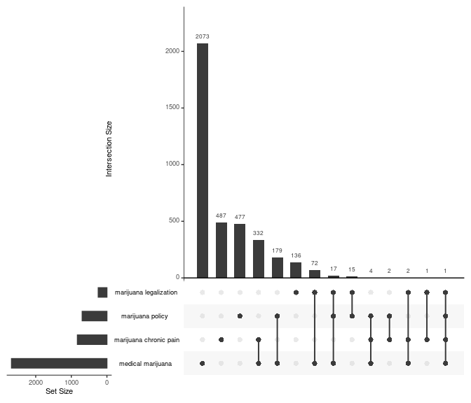

<!-- badges: start -->

[](https://app.travis-ci.com/github/jaytimm/pubmedr)
[](https://github.com/jaytimm/pubmedr/actions)
<!-- badges: end -->

# pubmedr

An R package for (1) querying the PubMed database & parsing retrieved
records; (2) extracting full text articles from the Open Access subset
of the PMC via ftp; (3) obtaining citation data from NIH’s Open Citation
Collection/[iCite](https://icite.od.nih.gov/); and (4) accessing
annotations of biomedical concepts from [PubTator
Central](https://www.ncbi.nlm.nih.gov/research/pubtator/).

## Installation

You can download the development version from GitHub with:

``` r
devtools::install_github("jaytimm/pubmedr")
```

## Usage

## PubMed search

The `pmed_search_pubmed()` function is meant for record-matching
searches typically performed using the [PubMed online
interface](https://pubmed.ncbi.nlm.nih.gov/). The `search_term`
parameter specifies the query term; the `fields` parameter can be used
to specify which fields to query.

``` r
med_cannabis <- pubmedr::pmed_search_pubmed(search_term = 'medical marijuana', 
                                            fields = c('TIAB','MH'))
```

    ## [1] "medical marijuana[TIAB] OR medical marijuana[MH]: 2680 records"

``` r
head(med_cannabis)
```

    ##          search_term     pmid
    ## 1: medical marijuana 36259301
    ## 2: medical marijuana 36226444
    ## 3: medical marijuana 36219744
    ## 4: medical marijuana 36219190
    ## 5: medical marijuana 36209703
    ## 6: medical marijuana 36195801

## Multiple search terms

``` r
cannabis_etc <- pubmedr::pmed_search_pubmed(
  search_term = c('marijuana chronic pain',
                  'marijuana legalization',
                  'marijuana policy',
                  'medical marijuana'),
  fields = c('TIAB','MH'))
```

    ## [1] "marijuana chronic pain[TIAB] OR marijuana chronic pain[MH]: 829 records"
    ## [1] "marijuana legalization[TIAB] OR marijuana legalization[MH]: 244 records"
    ## [1] "marijuana policy[TIAB] OR marijuana policy[MH]: 695 records"
    ## [1] "medical marijuana[TIAB] OR medical marijuana[MH]: 2680 records"

``` r
UpSetR::upset(UpSetR::fromList(split(cannabis_etc$pmid,
                                     cannabis_etc$search_term 
                                     )), 
              nsets = 4, order.by = "freq")
```



## Retrieve and parse abstract data

For quicker abstract retrieval, be sure to get an [API
key](https://support.nlm.nih.gov/knowledgebase/article/KA-03521/en-us).

``` r
med_cannabis_df <- pubmedr::pmed_get_records2(pmids = unique(med_cannabis$pmid), 
                                              with_annotations = T,
                                              cores = 5, 
                                              ncbi_key = key) 
```

``` r
med_cannabis_df0 <- data.table::rbindlist(med_cannabis_df)

n <- 1
list(pmid = med_cannabis_df0$pmid[n],
     year = med_cannabis_df0$year[n],
     journal = med_cannabis_df0$journal[n],
     articletitle = strwrap(med_cannabis_df0$articletitle[n], width = 60),
     abstract = strwrap(med_cannabis_df0$abstract[n], width = 60)[1:10])
```

    ## $pmid
    ## [1] "36259301"
    ## 
    ## $year
    ## [1] "2022"
    ## 
    ## $journal
    ## [1] "The journal of contemporary dental practice"
    ## 
    ## $articletitle
    ## [1] "Post-legalization Consumption of Cannabis at Massachusetts"
    ## [2] "General Hospital Dental Group."                            
    ## 
    ## $abstract
    ##  [1] "The aim of this study was to evaluate the profile of"       
    ##  [2] "patients undergoing dental treatment in relation to"        
    ##  [3] "cannabis use. A comprehensive questionnaire was used to"    
    ##  [4] "address the type of cannabis preparations, route of intake,"
    ##  [5] "frequency of usage, and potential reasoning for use"        
    ##  [6] "(recreational vs medical use) of patients from the MGH"     
    ##  [7] "Dental Group. Seventy-six adult patients completed the"     
    ##  [8] "survey. Sixty-one percent of the participants were female," 
    ##  [9] "with the majority (59%) of the participants being ≥51 years"
    ## [10] "or older. Twelve of the 76 participants (16%) were 18-30"

## MeSH Annotations

> Annotations are included as a list-column, and can be easily
> extracted:

``` r
annotations <- data.table::rbindlist(med_cannabis_df0$annotations)
```

``` r
annotations |>
  filter(!is.na(FORM)) |>
  slice(1:10) |>
  knitr::kable()
```

| ID       | TYPE | FORM              |
|:---------|:-----|:------------------|
| 36259301 | MeSH | Adult             |
| 36259301 | MeSH | Humans            |
| 36259301 | MeSH | Female            |
| 36259301 | MeSH | Male              |
| 36259301 | MeSH | Adolescent        |
| 36259301 | MeSH | Young Adult       |
| 36259301 | MeSH | Middle Aged       |
| 36259301 | MeSH | Cannabis          |
| 36259301 | MeSH | Medical Marijuana |
| 36259301 | MeSH | Cannabidiol       |

## Affiliations

The `pmed_get_affiliations` function extracts author and author
affiliation information from PubMed records.

``` r
pubmedr::pmed_get_affiliations(pmids = med_cannabis_df0$pmid) |>
  bind_rows() |>
  slice(1:10) |>
  knitr::kable()
```

| pmid     | Author                 | Affiliation                                                                                                                                                                                                                      |
|:---|:-------|:------------------------------------------------------------|
| 36259301 | Parad, Samantha        | Skeletal Biology Research Center, Department of Oral and Maxillofacial Surgery, Massachusetts General Hospital, Harvard School of Dental Medicine, Boston, Massachusetts, United States of America.                              |
| 36259301 | Hadad, Henrique        | Skeletal Biology Research Center, Department of Oral and Maxillofacial Surgery, Massachusetts General Hospital, Harvard School of Dental Medicine, Boston, Massachusetts, United States of America.                              |
| 36259301 | Matheus, Henrique R    | Skeletal Biology Research Center, Department of Oral and Maxillofacial Surgery, Massachusetts General Hospital, Harvard School of Dental Medicine, Boston, Massachusetts, United States of America.                              |
| 36259301 | Klein, Katherine P     | Skeletal Biology Research Center, Department of Oral and Maxillofacial Surgery, Massachusetts General Hospital, Harvard School of Dental Medicine, Boston, Massachusetts, United States of America.                              |
| 36259301 | Guastaldi, Fernando Ps | Skeletal Biology Research Center, Department of Oral and Maxillofacial Surgery, Massachusetts General Hospital, Harvard School of Dental Medicine, Boston, Massachusetts, United States of America, Phone: +16177265205, e-mail: |
| 36195790 | Grotenhermen, Franjo   | Zentrum für Cannabismedizin, Bahnhofsallee 9, 32839, Steinheim, Germany.                                                                                                                                                         |
| 35467781 | Bialas, Patric         | Department of Anesthesiology, Universitätskliniken des Saarlandes, Homburg/Saar, Germany.                                                                                                                                        |
| 35467781 | Fitzcharles, Mary-Ann  | Alan Edwards Pain Management Unit, McGill University Health Centre, Quebec, Canada.                                                                                                                                              |
| 35467781 | Fitzcharles, Mary-Ann  | Division of Rheumatology, McGill University Health Centre, Quebec, Canada.                                                                                                                                                       |
| 35467781 | Klose, Petra           | Department Internal and Integrative Medicine, Kliniken Essen-Mitte, Faculty of Medicine, University of Duisburg-Essen, Essen, Germany.                                                                                           |

## Citation data

The `pmed_get_icites` function can be used to obtain citation data per
PMID using NIH’s Open Citation Collection and
[iCite](https://icite.od.nih.gov/).

> Hutchins BI, Baker KL, Davis MT, Diwersy MA, Haque E, Harriman RM, et
> al. (2019) The NIH Open Citation Collection: A public access, broad
> coverage resource. PLoS Biol 17(10): e3000385.
> <https://doi.org/10.1371/journal.pbio.3000385>

### Summary data

The iCite API returns a host of descriptive/derived citation details per
record.

``` r
citations <- pubmedr::pmed_get_icites(pmids = med_cannabis_df0$pmid, 
                                      cores = 6,
                                      ncbi_key = key)

c0 <- citations |> select(-citation_net) |> slice(4)
setNames(data.frame(t(c0[,-1])), c0[,1]) |> knitr::kable()
```

|                             | 34888981                                                             |
|:--------------------|:--------------------------------------------------|
| year                        | 2022                                                                 |
| title                       | Coordinating cannabis data collection globally: Policy implications. |
| authors                     | Susan R B Weiss, Nora D Volkow                                       |
| journal                     | Addiction                                                            |
| is_research_article         | Yes                                                                  |
| relative_citation_ratio     | NA                                                                   |
| nih_percentile              | NA                                                                   |
| human                       | 0.5                                                                  |
| animal                      | 0.5                                                                  |
| molecular_cellular          | 0                                                                    |
| apt                         | 0.05                                                                 |
| is_clinical                 | No                                                                   |
| citation_count              | 2                                                                    |
| citations_per_year          | 2                                                                    |
| expected_citations_per_year | 1.992031                                                             |
| field_citation_rate         | 3.346756                                                             |
| provisional                 | No                                                                   |
| x_coord                     | 0.4330127                                                            |
| y_coord                     | 0.25                                                                 |
| cited_by_clin               | NA                                                                   |
| doi                         | 10.1111/add.15751                                                    |
| ref_count                   | 8                                                                    |

### Network data

> Referenced and cited-by PMIDs are returned by the function as a
> column-list of network edges.

``` r
citations$citation_net[[4]] |> head()
```

    ##        from       to
    ## 1: 34888981 34590359
    ## 2: 34888981 34156452
    ## 3: 34888981 28953512
    ## 4: 34888981 29742676
    ## 5: 34888981 34888981
    ## 6: 34888981 32214334

## Biomedical concepts via the Pubtator Central API

> Wei, C. H., Allot, A., Leaman, R., & Lu, Z. (2019). PubTator central:
> automated concept annotation for biomedical full text articles.
> Nucleic acids research, 47(W1), W587-W593.

``` r
pubtations <- unique(med_cannabis$pmid) |>
  pubmedr::pmed_get_entities(cores = 6) |>
  data.table::rbindlist()

pubtations |> na.omit() |> slice(1:20) |> knitr::kable()
```

| pmid     | tiab     | id  | text         | identifier   | type     | offset | length |
|:---------|:---------|:----|:-------------|:-------------|:---------|:-------|:-------|
| 36259301 | abstract | 19  | patients     | 9606         | Species  | 148    | 8      |
| 36259301 | abstract | 20  | patients     | 9606         | Species  | 424    | 8      |
| 36259301 | abstract | 21  | patients     | 9606         | Species  | 487    | 8      |
| 36259301 | abstract | 22  | participants | 9606         | Species  | 543    | 12     |
| 36259301 | abstract | 23  | participants | 9606         | Species  | 600    | 12     |
| 36259301 | abstract | 24  | participants | 9606         | Species  | 657    | 12     |
| 36259301 | abstract | 25  | patients     | 9606         | Species  | 715    | 8      |
| 36259301 | abstract | 26  | participants | 9606         | Species  | 802    | 12     |
| 36259301 | abstract | 27  | patients     | 9606         | Species  | 855    | 8      |
| 36259301 | abstract | 28  | patients     | 9606         | Species  | 884    | 8      |
| 36259301 | abstract | 29  | patients     | 9606         | Species  | 916    | 8      |
| 36259301 | abstract | 30  | participants | 9606         | Species  | 1183   | 12     |
| 36259301 | abstract | 31  | cannabidiol  | MESH:D002185 | Chemical | 1238   | 11     |
| 36259301 | abstract | 32  | CBD          | MESH:D002185 | Chemical | 1251   | 3      |
| 36259301 | abstract | 33  | participants | 9606         | Species  | 1337   | 12     |
| 36259301 | abstract | 34  | participants | 9606         | Species  | 1360   | 12     |
| 36259301 | abstract | 35  | patients     | 9606         | Species  | 1483   | 8      |
| 36259301 | abstract | 36  | marijuana    | 3483         | Species  | 1535   | 9      |
| 36259301 | abstract | 37  | patient      | 9606         | Species  | 1751   | 7      |
| 36226444 | title    | 2   | Marijuana    | 3483         | Species  | 95     | 9      |

## Full text from Open Acess PMC

### Load list of Open Access PMC articles

``` r
pmclist <- pubmedr::pmed_load_pmclist()
pmc_med_cannabis <- pmclist |> filter(PMID %in% unique(med_cannabis$pmid))
pmc_med_cannabis |> head() |> knitr::kable()
```

| fpath                              | journal                                          | PMCID   | PMID     | license_type |
|:---------------------|:-----------------------------|:-----|:------|:--------|
| oa_package/06/f8/PMC2267789.tar.gz | Harm Reduct J. 2008 Jan 28; 5:5                  | 2267789 | 18226254 | CC BY        |
| oa_package/b1/ba/PMC2848643.tar.gz | Harm Reduct J. 2010 Mar 5; 7:3                   | 2848643 | 20202221 | CC BY        |
| oa_package/7c/37/PMC2990823.tar.gz | Indian J Psychiatry. 2010 Jul-Sep; 52(3):236-242 | 2990823 | 21180408 | CC BY        |
| oa_package/6f/9a/PMC3358713.tar.gz | Open Neurol J. 2012 May 4; 6:18-25               | 3358713 | 22629287 | CC BY-NC     |
| oa_package/38/6d/PMC3507655.tar.gz | Addict Sci Clin Pract. 2012 Apr 19; 7(1):5       | 3507655 | 23186143 | CC BY        |
| oa_package/cb/ad/PMC3628147.tar.gz | Med Sci Monit. 2011 Dec 1; 17(12):RA249-RA261    | 3628147 | 22129912 | NO-CC CODE   |

### Extract full text articles

``` r
med_cannabis_fulltexts <- pmc_med_cannabis$fpath[1] |> 
  pubmedr::pmed_get_fulltext()
  #pubmedr::pmed_get_fulltext()

samp <- med_cannabis_fulltexts |> filter(pmcid %in% pmc_med_cannabis$PMCID[1])

lapply(samp$text, function(x){strwrap(x, width = 60)[1:3]})
```

    ## [[1]]
    ## [1] "1. Introduction Although modern medicine has only recently"
    ## [2] "begun to rediscover the therapeutic potential of cannabis,"
    ## [3] "written records of medical use date back thousands of"     
    ## 
    ## [[2]]
    ## [1] "2. Health Canada's Marihuana Medical Access Division The"   
    ## [2] "federal government's own polling and research suggests that"
    ## [3] "there are currently over 290,000 medical users in the"      
    ## 
    ## [[3]]
    ## [1] "3. The Canadian Institute of Health Research and the"      
    ## [2] "Medical Marihuana Research Program Since the court-ordered"
    ## [3] "implementation of a federal medical cannabis policy in"    
    ## 
    ## [[4]]
    ## [1] "4. Health Canada's Production and Supply Policy and"     
    ## [2] "Practice In December 2000 Health Canada awarded a"       
    ## [3] "five-year, $5.7 million contract for the production of a"
    ## 
    ## [[5]]
    ## [1] "5. Community-Based Alternatives to a Centralized Medical"    
    ## [2] "Cannabis Program\"As far as the distribution of marijuana to"
    ## [3] "qualified users is concerned, the government might consider" 
    ## 
    ## [[6]]
    ## [1] "6. Discussion and Conclusion Since 1999 the Canadian"       
    ## [2] "government has spent over $30 million in funding for the"   
    ## [3] "research, production and distribution of medicinal cannabis"
    ## 
    ## [[7]]
    ## [1] "Competing interests The author is the founder and director"
    ## [2] "of the Vancouver Island Compassion Society, and receives a"
    ## [3] "salary from this organization for research, communications"
